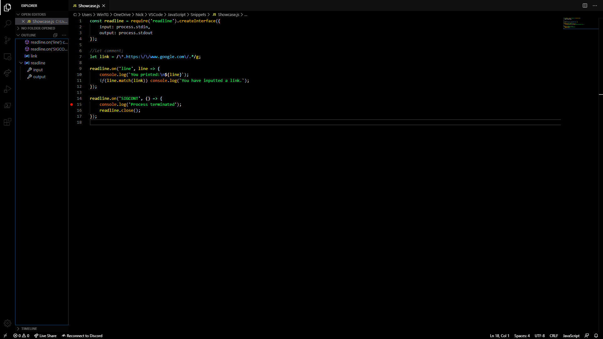

SoDark
======

SoDark is a color theme designed to be as dark as possible while maintaining visibility of your codes in most light levels.

SoDark is still a work in progress but otherwise, it is ready to use out of the box.

Sample:

----------
#### Useful Links

* [Github repository](https://github.com/NickGenghar/SoDark)
* [Report bugs here](https://github.com/NickGenghar/SoDark/issues)